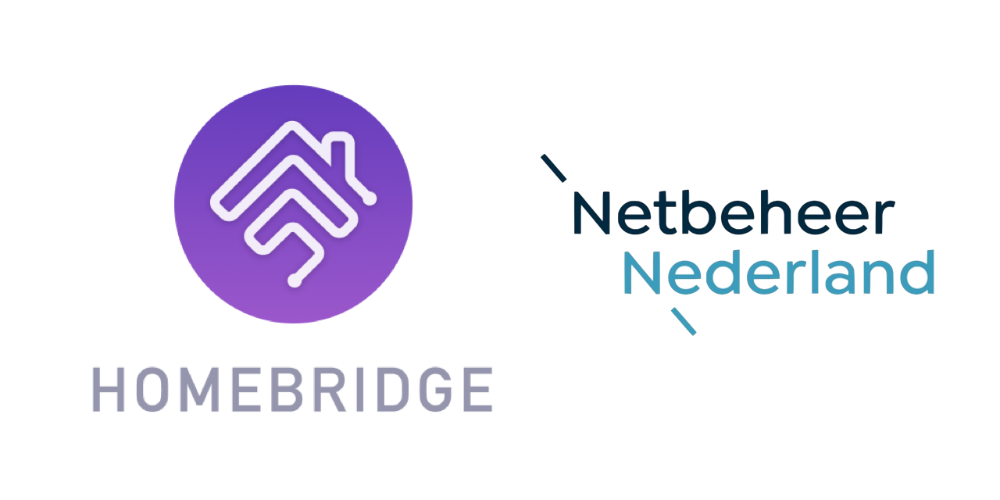

<p align="center">
  
</p>
<span align="center">

# Homebridge P1
[](https://www.npmjs.com/package/homebridge-p1)
[](https://www.npmjs.com/package/homebridge-p1)
[](https://discord.gg/8nfZrcV)
[](https://github.com/homebridge/homebridge/wiki/Verified-Plugins)

[](https://github.com/ebaauw/homebridge-p1/issues)
[](https://github.com/ebaauw/homebridge-p1/pulls)
[](https://standardjs.com)

</span>

## Homebridge plugin for DSMR end-consumer (P1) interface
Copyright © 2018-2021 Erik Baauw. All rights reserved.

This [Homebridge](https://github.com/homebridge/homebridge) plugin exposes a smart meter to Apple's [HomeKit](http://www.apple.com/ios/home/), using the end-consumer (P1) interface of the [Dutch Smart Meter Requirements (DSMR)](https://www.netbeheernederland.nl/_upload/Files/Slimme_meter_15_a727fce1f1.pdf).
It provides insight from HomeKit into your actual and historic energy consumption.

The smart meter sends a push notification ("telegram" in DSMR speak), every second, updating the electricity consumption almost in real time.
Older versions of DSMR might send notifications less frequently.
Gas consumption is updated once every five minutes.
Homebridge P1 maintains the historic consumption.

Depending on the smart meter capabilities, Homebridge P1 exposes up to three
HomeKit accessories:
- _Electricity_ for electricity consumed;
- _Electricity Delivered_ for electricity delivered back to the network (if you have solar panels);
- _Gas_ for natural gas consumed (if a smart gas meter has been linked to the smart electricity meter);

Each accessory exposes a service with `Total Consumption`, just like an Eve Energy, enabling the [Eve](https://www.evehome.com/en/eve-app) app to display the consumption history.
Eve computes the `Total Cost` and `Projected Cost`.

In case of 3-phase electricity, the accessory contains a service per phase showing _Power_, _Current_, and _Voltage_.

### Prerequisites
You need a smart meter that provides a P1 port that complies to DSMR (currently DSMR 5.0, DSMR 4.2, and DSMR 2.2+ are tested).<br>
The companies maintaining the electricity and natural gas networks in the Netherlands, united in [Netbeer Nederland](https://www.netbeheernederland.nl) are [replacing](https://www.onsenergie.net/slimme-meter/) existing electricity and gas meters with smart meters.
In my home, they installed a [Landys +Gyr E350 (ZCF1100)](https://www.landisgyr.eu/product/landisgyr-e350-electricity-meter-new-generation/).<br>
Smart meters in Flandres (Belgium), Luxembourg, and [Sweden](https://hanporten.se/svenska/protokollet/) might provide a P1 port as well.
I don't know about the rollout plans in those countries.
One Flandres installation is reported working, see [#47](https://github.com/ebaauw/homebridge-p1/issues/47); one Swedish installation is reported not working, see [#50](https://github.com/ebaauw/homebridge-p1/issues/50).

You need a cable to connect the smart meter's P1 port to a USB port.
I got mine [here](https://www.sossolutions.nl/slimme-meter-kabel), but you could also make one yourself, as described [here](http://gejanssen.com/howto/Slimme-meter-uitlezen/).
The cable is quite short (~1m) but you can extend it using a regular USB extension cable (female-A to A).

You need a server to run Homebridge.
This can be anything running [Node.js](https://nodejs.org): from a Raspberry Pi, a NAS system, or an always-on PC running Linux, macOS, or Windows.
See the [Homebridge Wiki](https://github.com/homebridge/homebridge/wiki) for details.
I run Homebridge P1 on a Raspberry Pi 3B+.

Note that Homebridge P1 uses the [`serialport`](https://github.com/serialport/node-serialport) package to connect to the P1 cable.
This package uses some non-JavasScript addons, that need to be compiled while installing Homebridge P1.
The server running Homebridge P1 needs to have the appropriate development tools installed.

The user running Homebridge needs privileges to list the serial port devices and to open the serial port device for the P1 cable.
Under Raspbian, user `pi` has these privileges by default.
If you run Homebridge under a different user, make sure it's member of the `dialout` group, and, for Buster, of the `gpio` group.

To interact with HomeKit, you need Siri or a HomeKit app on an iPhone, Apple Watch, iPad, iPod Touch, or Apple TV (4th generation or later).
I recommend to use the latest released versions of iOS, watchOS, and tvOS.  
Please note that Siri and even Apple's [Home](https://support.apple.com/en-us/HT204893) app still provide only limited HomeKit support.
To use Homebridge P1, you want to check out some other HomeKit apps, like the [Eve](https://www.evehome.com/en/eve-app) app (free) or Matthias Hochgatterer's [Home+](https://hochgatterer.me/home/) app (paid).  

As HomeKit uses Bonjour to discover Homebridge, the server running Homebridge must be on the same subnet as your iDevices running HomeKit.
For remote access and for HomeKit automations, you need to setup an Apple TV (4th generation or later), HomePod, or iPad as [home hub](https://support.apple.com/en-us/HT207057).

### Installation
To install Homebridge P1:
- Follow the instructions on the [Homebridge Wiki](https://github.com/homebridge/homebridge/wiki) to install Node.js and Homebridge;
- Install the Homebridge P1 plugin through Homebridge Config UI X or manually by:
  ```
  $ sudo npm -g i homebridge-p1 --unsafe-perm
  ```
- Edit `config.json` and add the `P1` platform provided by Homebridge P1, see [**Configuration**](#configuration).

### Configuration
Homebridge P1 should detect the USB serial cable automatically.
In case it doesn't or when you have multiple USB serial devices, you can specify the serialport in config.json:
```json
"platforms": [
  {
    "platform": "P1",
    "serialport": "/dev/ttyUSB0"
  }
]
```
If Homebridge P1 doesn't receive any data and you have a meter with an older DSMR version, you might need to specify:
```json
"platforms": [
  {
    "platform": "P1",
    "serialport": "/dev/ttyUSB0",
    "dsmr22": true
  }
]
```
If Homebridge P1 receives data too late (i.e. after the Homebridge server has started) no accessories will be exposed to HomeKit.
In this case, set `"timeout"` in config.json and restart Homebridge.
This parameter specifies the number of seconds Homebridge P1 waits for data, before giving up and letting Homebridge startup continue without any P1 accessories.
Note that accessories from other plugins will not be reachable while Homebridge P1 waits for data, so you want to set `"timeout"` as low as possible, while keeping in mind a telegram might be lost due to communication glitches.
The default of `"timeout": 5` assumes the meter sends a telegram every second.  DSMR v2.2 meters only send a telegram every 10 seconds, so when `"dsmr22": true` is set, a default `"timeout": 50` is used.

### Caveats
Homebridge P1 is a hobby project of mine, provided as-is, with no warranty whatsoever.  I've been running it successfully at my home for years, but your mileage might vary.

The HomeKit terminology needs some getting used to.
An _accessory_ more or less corresponds to a physical device, accessible from your iOS device over WiFi or Bluetooth.
A _bridge_ (like Homebridge) is an accessory that provides access to other, bridged, accessories.
An accessory might provide multiple _services_.
Each service corresponds to a virtual device (like a lightbulb, switch, motion sensor, ..., but also: a programmable switch button, accessory information, battery status).
Siri interacts with services, not with accessories.
A service contains one or more _characteristics_.
A characteristic is like a service attribute, which might be read or written by HomeKit apps.
You might want to checkout Apple's [HomeKit Accessory Simulator](https://developer.apple.com/documentation/homekit/testing_your_app_with_the_homekit_accessory_simulator), which is distributed as an additional tool for `Xcode`.

Exposing the smart meter to HomeKit is a bit of a hack, lacking proper HomeKit support for smart meters.  Also, Eve lacks proper support for gas consumption.  The following limitations apply:
- The Electricity consumption is the combined consumption under Normal and Low tariff.  If you have a dual-tariff contract, the cost computed by Eve will be inaccurate;
- The Gas consumption is actually in m³, but Eve displays kWh.  If Homebridge P1 would expose different characteristics for gas consumption, Eve would display the correct units, but not the history.  To see the correct cost for Gas, you need to change the _Energy Cost_ under _Settings_ in Eve to match you Gas rate;
- Eve doesn't take into account fixed (subscription) costs, so the cost displayed is only the variable cost.
